# Image Effect Experiment

This project started out as just me wanting to learn more about dithering and more image effects. After looking into algorithms and other code I've seen online, this is what I've got!

**Note:** You can technically use this as a library - but it's definitely not currently stable so you may experience major breakages. I have a separate repository at [image-tool-assortment](https://github.com/enbyss/image-tool-assortment) which shows multiple projects I'm working on *with* this library if you'd like to see examples - but if you use this library *(for now)* then be ready for breaking changes.

Feel free to open issues / pull requests / fork if you'd like! I'd love to grow this thing into something better!

## Dithering

### Methodology

The **1-bit** dithering is separated purely for convenience, since needing to specify a black and white palette every time can be a bit annoying. Internally it just calls the normal error propagation function with a **one-bit** palette.

**Bayer** and **Basic** are separated from the rest in implementation due to how differently they work. **Bayer**, also known as *ordered dithering*, doesn't propagate any errors and just manipulates each pixel on the spot using a matrix. **Basic**, being the *naive* implementation, simply propagates the error to the right.

All other algorithms are variations on **error propagation** by using different parameters. As such the implementation works by creating a general error propagation function which takes:

- a `list` of propagation offsets - aka where to send the error and *by how much*. For example if a matrix offers **30** divisions, `(1, 0, 5)` would point to the *next* pixel `(x+1, y)` and send over **5/30ths** of the error.
- the *amount of division*. Most algorithms split the error totally - but some like *Atkison* only propagate *some*.

After this, each of these algorithms were effectively generated using a macro.

### Algorithms

Currently supports the following dithering algorithms:

|            **Name** | *1-bit*                                         | *RGB (Web-safe)*                                    | *RGB (8-bit)*                                    |
| ------------------: | :---------------------------------------------- | :-------------------------------------------------- | :----------------------------------------------- |
|               Basic |                |                |                |
|     Floyd-Steinberg |      |      |      |
| Jarvis-Judice-Ninke |  |  |  |
|              Stucki |               | 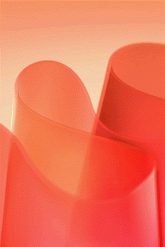              |               |
|            Atkinson | 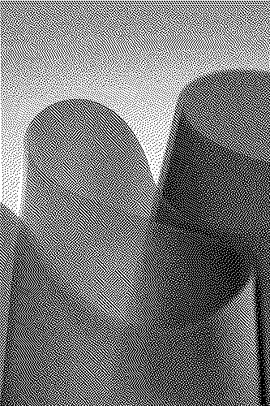            |             | 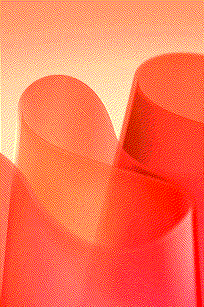            |
|              Burkes |               |               |               |
|              Sierra |               |               | 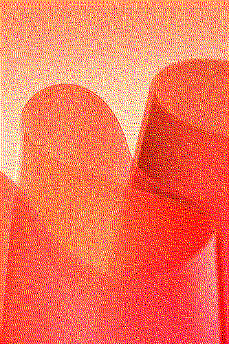              |
|        SierraTwoRow |       |       |       |
|          SierraLite |          |          |          |
|           Bayer 2x2 |            |            | 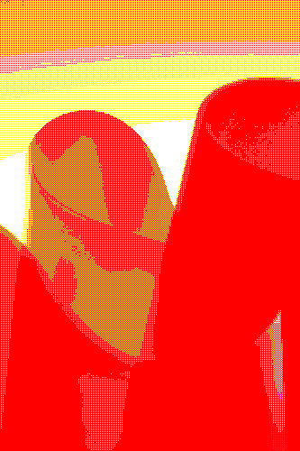           |
|           Bayer 4x4 |            |            |            |
|           Bayer 8x8 |            |            | 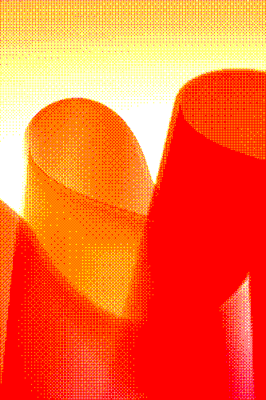           |
|         Bayer 16x16 | 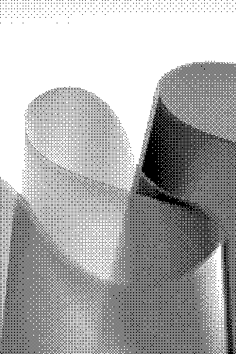         |          | 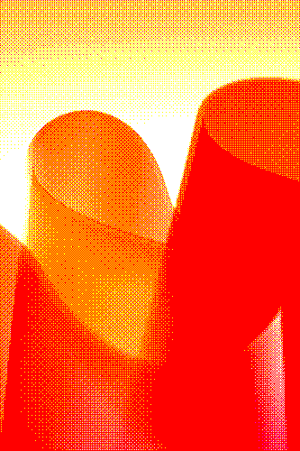         |

## Filters

### Methodology

For colour, certain filters such as *brightness, saturation, hue rotation*, are done by first mapping each RGB pixel to HSL or LCH.
Originally, HSL was used due to the ease of computation - however LCH is significantly more accurate in representing each of its
components.

However, `RGB -> LCH` requires more computation than `RGB -> HSL`. Currently the code requires you change it in order to use the right pixel,
but it may be worth looking into allowing the user to use HSL instead for maximal speed.

### Algorithms

Currently supports the following effects:

|         **Name** | *Image*                                |
| ---------------: | -------------------------------------- |
|    brighten +0.2 | 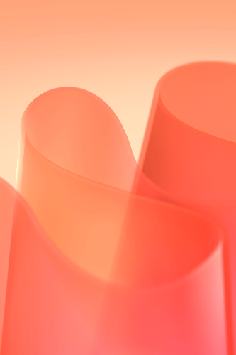    |
|    brighten -0.2 | 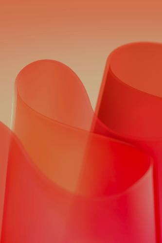    |
|    saturate +0.2 | 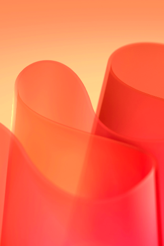   |
|    saturate -0.2 | 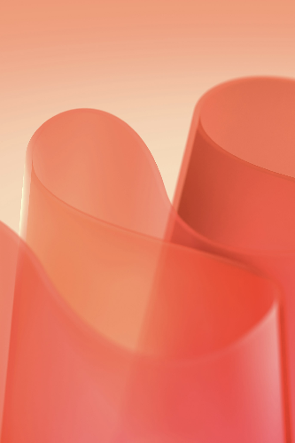   |
|     contrast 0.5 | 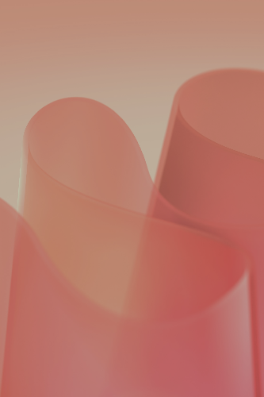    |
|     contrast 1.5 |     |
| gradient mapping |  |
|   rotate hue 180 | 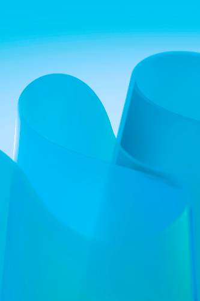  |
|     quantize hue |     |

The scale of parameters are as follows:

- **brighten**: takes `-1.0` to `1.0`. Positive numbers boost the brightness, with **1.0** setting it to maximum luminance - and vice versa.
- **saturate**: same as **brighten** - a max chroma of **128** is assumed *(matching with `palette`'s documentation)* to facilitate the scale.
- **contrast**: takes any float.
  - `x > 1.0` increases contrast..
  - `x > 0.0 and x < 1.0` decreases contrast.
  - *negative contrast* obeys a similar scale, where `-1.0` is the same as `1.0` - but with each colour channel being inverted.
  - *might* be fun to try doing contrast calculations in other spaces... something for me to look into.

Anything else has a specific type (`quantize hue`, `gradient mapping`), or acts as expected (`rotate hue`)

## Colours

At one point, I started implementing all the colour spaces and conversions between them manually. Had a whole sub-library with it - but then I discovered that someone else did it before me [*way better*](https://docs.rs/palette/latest/palette/) and ended up throwing away all of my code.

Is what I would say if I wasn't a hoarder.

All of that code is now on [`colour-exercise-rs`](https://github.com/enbyss/colour-exercise-rs) - from **RGB** to **HSL** to **LAB** to **OKLCH** *and more* - technically not useful as a library since it's better to just use `palette`, but if you're ever interested in learning about colour - and think seeing someone stumbling through it while *they* were learning would help - feel free to look!

One remnant of that remains however. `colour/comparisons.rs` implements multiple distance functions.

### [`colour/comparisons.rs`](./src/colour/comparisons.rs)

### Methodology

For now, the colour distance function used is **weighted euclidean**, which looks like this:

$$
f(R, G, B) = \begin{cases}
    \sqrt{2\Delta R^2 + 4\Delta G^2 + 3\Delta B^2} & \overline{R} < 128, \\
    \sqrt{3\Delta R^2 + 4\Delta G^2 + 2\Delta B^2} & \textrm{otherwise},
\end{cases}
$$

This library also has *other* distance functions - such as `cie76`, `cie94`, and `ciede2000`. The reason why **weighted euclidean** is being used instead is mostly for efficiency *and* because it's been deemed good enough. However the code should be easily changeable to use any of the other functions, so the function used may change / turn into an option.

`ciede2000` in particular is *significantly* more complicated, and may be slower by an order of magnitude. It can likely become more efficient, but as is it's a bit unfeasible for use.