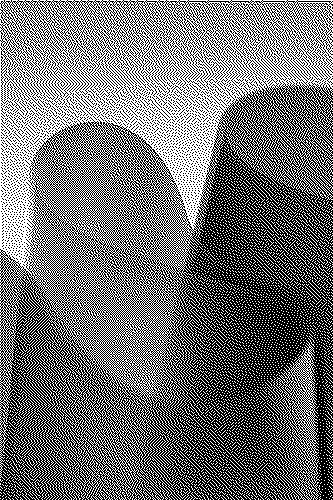
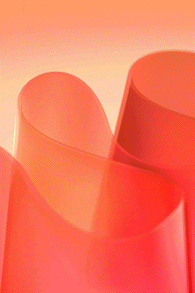
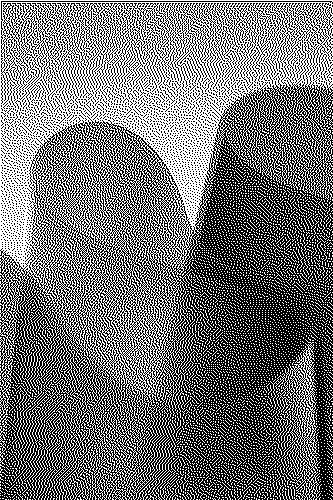
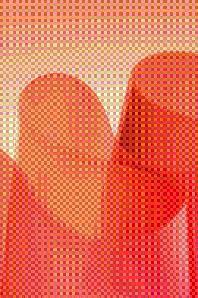
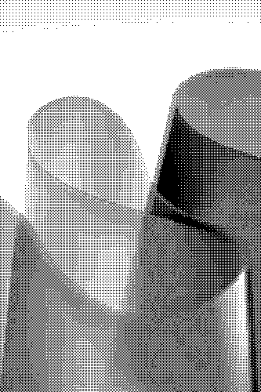
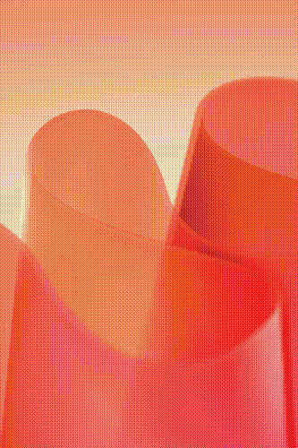
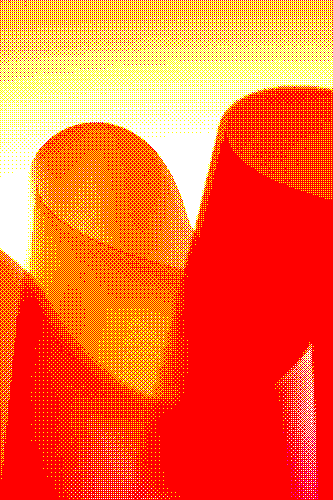
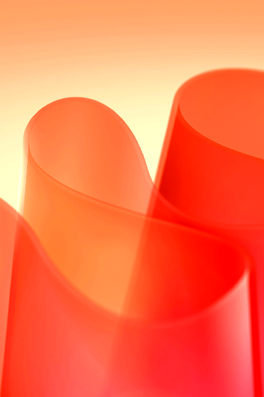

# Image Effect Experiment

The name is a placeholder - this project started out as just me wanting to learn more about dithering and more image effects. After looking into algorithms and other code I've seen online, this is what I've got!

**Note:** You can technically use this as a library - but it's definitely not currently stable so you may experience major breakages. The `src/main.rs` and `src/lib.rs` should contain examples in this case. I *suggest* not using it for anything other than side projects. It might get published, but currently I don't think it's at *that* level of quality yet.

Feel free to open issues / pull requests / fork if you'd like.

## Dithering

The **2-bit** dithering is separated purely because it lacks the need of a colour distance function, which makes it faster by default.

For now, the colour distance function used is **weighted euclidean**, which looks like this:

$$
f(R, G, B) = \begin{cases}
    \sqrt{2\Delta R^2 + 4\Delta G^2 + 3\Delta B^2} & \overline{R} < 128, \\
    \sqrt{3\Delta R^2 + 4\Delta G^2 + 2\Delta B^2} & \textrm{otherwise},
\end{cases}
$$

Currently supports the following algorithms:

|            **Name** | *2-bit*                                         | *RGB (Web-safe)*                                    | *RGB (8-bit)*                                    |
| ------------------: | :---------------------------------------------- | :-------------------------------------------------- | :----------------------------------------------- |
|               Basic |                |                |                |
|     Floyd-Steinberg |      |      |      |
| Jarvis-Judice-Ninke |  |  |  |
|              Stucki |               |               |               |
|            Atkinson |             |             |             |
|              Burkes |               |               |               |
|              Sierra |               |               |               |
|        SierraTwoRow |       |       |       |
|          SierraLite |          |          |          |
|           Bayer 2x2 |            |            |            |
|           Bayer 4x4 |            |            |            |
|           Bayer 8x8 |            |            |            |
|         Bayer 16x16 |          |          |          |

## Colour

For colour, certain filters such as *brightness, saturation, hue rotation*, are done by first mapping each RGB pixel to HSL or LCH.
Originally, HSL was used due to the ease of computation - however as LCH is significantly more accurate in representing each of its
components HSL was soon replaced with LCH.

However, `RGB -> LCH` requires more computation than `RGB -> HSL`. Currently the code requires you change it in order to use the right pixel,
but it may be worth looking into allowing the user to use HSL instead for maximal speed.

Currently supports the following effects:

|         **Name** | *Image*                                |
| ---------------: | -------------------------------------- |
|    brighten +0.2 |     |
|    brighten -0.2 |     |
|     contrast 0.5 |     |
|     contrast 1.5 |     |
| gradient mapping |  |
|   rotate hue 180 |   |
|    saturate +0.2 |     |
|    saturate -0.2 |     |
|     quantize hue |     |