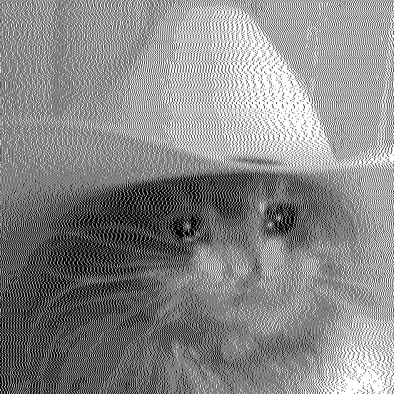

# Dithering Experiment

The name is a placeholder - this project started out as just me wanting to learn more about dithering. After looking into algorithms and other code I've seen online, this is what I've got!

Might become a library, or a tool. I'd like to provide a good GUI for it at least.

Currently supports the following algorithms:

|            **Name** |                                  *2-bit* |                    *RGB (Web-safe)* | *RGB (8-bit)* |
| ------------------: | ---------------------------------------: | ----------------------------------: | :-----------: |
|               Basic |                |                |                |
|     Floyd-Steinberg |      |      |      |
| Jarvis-Judice-Ninke |  |  |  |
|              Stucki |               |               |               |
|            Atkinson |             |             |             |
|              Burkes |               |               |               |
|              Sierra |               |               |               |
|        SierraTwoRow |       |       |       |
|          SierraLite |          |          |          |
|           Bayer 2x2 |            |            |            |
|           Bayer 4x4 |            |            |            |
|           Bayer 8x8 |            |            |            |
|         Bayer 16x16 |          |          |          |